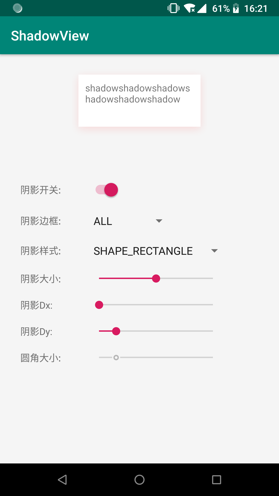
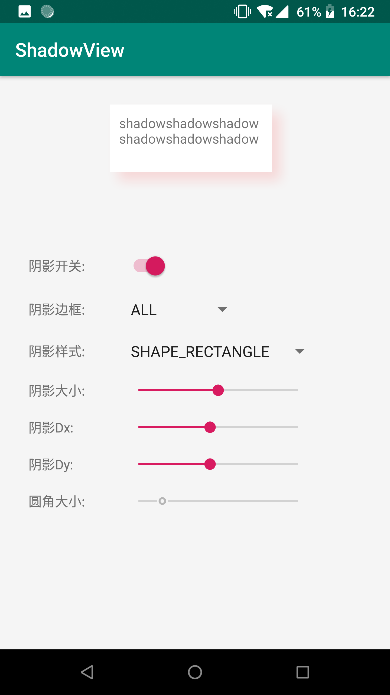

# ShadowView

自定义阴影组件

支持 `API >= 16`，理论支持`API 16`以下，未经测试

### 效果图

### 使用

在需要添加阴影的组件上添加ShadowView

    <com.darklycoder.lib.ShadowView
        android:id="@+id/view_shadow"
        android:layout_width="200dp"
        android:layout_height="100dp"
        android:layout_gravity="center_horizontal"
        android:layout_marginTop="20dp"
        app:shadowColor="#1FFF0000"
        app:shadowDy="3dp"
        app:shadowRadius="3dp">

        <TextView
            android:layout_width="match_parent"
            android:layout_height="match_parent"
            android:background="#FFF"
            android:ellipsize="end"
            android:maxLines="2"
            android:padding="10dp"
            android:text="shadowshadowshadowshadowshadowshadow" />

    </com.darklycoder.lib.ShadowView>

### 自定义属性说明

| 属性名  | 说明 |
| ------ | ------ |
| shadowColor | 阴影色值，需要带透明度 |
| shadowRadius | 阴影半径|
| shadowDx | 阴影x轴偏移|
| shadowDy | 阴影y轴偏移 |
| radius | shadowShape为圆角矩形(round)时表示圆角大小，其它情况无意义 |
| shadowShape | 阴影形状，支持rectangle/oval/round ，默认为rectangle|
| shadowSide | 阴影显示方向，支持all/left/top/right/bottom，默认为all |
